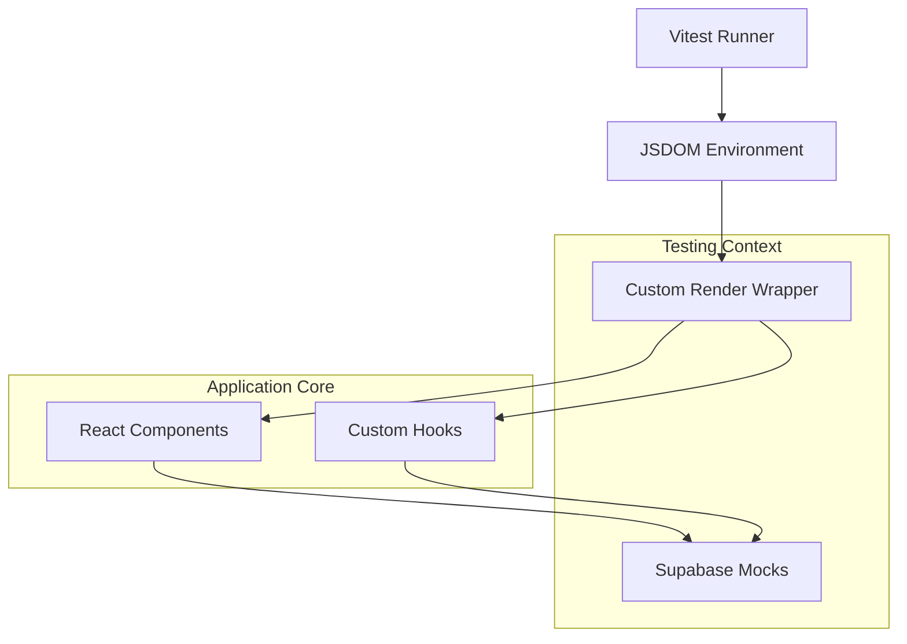

# SkillSplit Testing Documentation and Coverage Report

This document outlines the testing architecture, methodology, and coverage status for the SkillSplit application. The suite is designed to ensure the integrity of financial calculations, data aggregation, and user interface stability across the core application flows.

## Testing Architecture

The following diagram represents the relationship between the testing environment and the application components.



## Test Suite Overview

The test suite consists of 32 test cases distributed across 15 files, categorized into utility units, logic hooks, and integration pages.

| Category | Test File | Scope | Status |
| :--- | :--- | :--- | :--- |
| Core Utility | auditLog.test.ts | Audit logging logic and error handling | Passed |
| Data Hooks | useGroups.test.ts | Multi-group data aggregation | Passed |
| Data Hooks | useGroupDetail.test.ts | Pairwise debt and settlement logic | Passed |
| Data Hooks | useExpenses.test.ts | Dashboard statistics aggregation | Passed |
| Data Hooks | useOptimization.test.ts | Debt simplification algorithm | Passed |
| Data Hooks | useDisputes.test.ts | Dispute management lifecycle | Passed |
| Data Hooks | useActivityLog.test.ts | Historical logging and grouping | Passed |
| UI Components | Sidebar.test.tsx | Navigation and user profile rendering | Passed |
| UI Components | CreateGroupModal.test.tsx | Group initialization flow | Passed |
| UI Components | AddExpenseModal.test.tsx | Complex financial splitting logic | Passed |
| UI Components | SettleUpModal.test.tsx | Debt clearance and settlement flow | Passed |
| UI Components | AddMemberModal.test.tsx | User search and onboarding | Passed |
| Integration | Dashboard.test.tsx | Aggregated overview screen | Passed |
| Integration | GroupDetail.test.tsx | Detailed group financial view | Passed |
| Environment | sanity.test.ts | Vitest/JSDOM configuration check | Passed |

## Detailed Test Case Catalog

### 1. Financial and Algorithmic Logic

The most critical part of the application involves the calculation of debts and the optimization of settlements.

- **Debt Simplification**: The `useOptimization` test validates the greedy algorithm that reduces the total number of transactions required to settle a group. It ensures that net balances are preserved while minimizing overhead.
- **Pairwise Balances**: The `useGroupDetail` test simulates multiple participants paying for various expenses. It verifies that the "who owes whom" logic correctly accounts for both confirmed settlements and raw expense shares.
- **Aggregation Accuracy**: `useExpenses` and `useGroups` tests verify that sums across multiple relational tables in Supabase (memberships, expenses, participants) return consistent results for the dashboard summary.

### 2. User Interaction and Forms

Form-based components are tested to ensure they correctly communicate with the backend via the mocked Supabase client.

- **Expense Splitting**: `AddExpenseModal` is tested for "Equal Split" logic. It ensures that participants are correctly identified and that the shares assigned to each user are mathematically correct (including rounding handling).
- **Group Management**: `CreateGroupModal` and `AddMemberModal` tests verify the initialization of group metadata and the prevention of duplicate memberships.
- **Settlement Process**: `SettleUpModal` tests verify that the UI correctly identifies which members a user owes money to and blocks settlements for members with positive balances.

### 3. Integration and Page States

Integration tests verify that pages correctly display loading states and handle data propagation from multiple hooks.

- **Dashboard Integration**: Tests the interaction between authentication state, profile data, and the dashboard statistics hook.
- **Group Detail Integration**: Verifies that the spending overview, expense list, and balance sidebar all render correctly based on a single group's data set.

## Mocking and Data Strategy

To ensure deterministic results and avoid external network dependencies, a comprehensive mocking strategy is used:

- **Supabase Client**: The `@supabase/supabase-js` client is mocked using a chainable pattern. This allows the simulation of multi-step queries such as `from().select().eq().single()`.
- **Authentication Context**: The `AuthContext` is mocked to simulate different user profiles and roles (admin vs member) without requiring a real login flow.
- **Audit Logging**: The `auditLog` utility is mocked to verify that side-effects (like logging an action) occur during component interactions without actually writing to a database.

## Execution

The entire suite can be executed using the following command:

```bash
npm run test
```

This runs Vitest in a headless environment using JSDOM to simulate the browser's DOM API.
