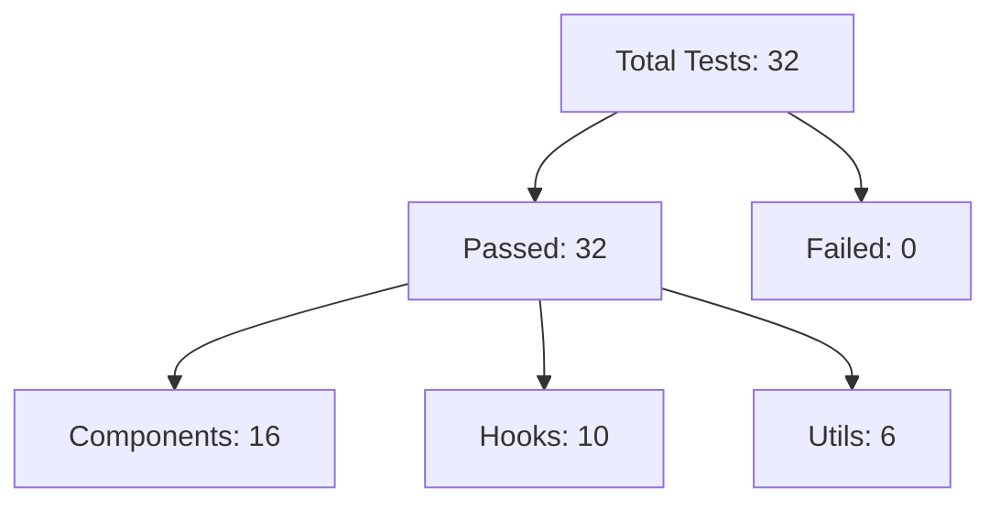

# SkillSplit Test Coverage and Documentation

This document provides a detailed overview of the test cases, coverage metrics, and the architecture of the SkillSplit testing suite.

## Test Infrastructure
- **Framework:** Vitest
- **UI Testing:** React Testing Library
- **Mocks:** Custom Supabase and AuthContext mocks
- **Environment:** JSDOM

## Test Case Matrix

### UI Components

| Component | Test Scenarios | Coverage |
| :--- | :--- | :--- |
| **Sidebar** | - Rendering for auth users - Logout confirmation flow | High |
| **AddMemberModal** | - User search functionality - Error handling for existing members | High |
| **SettleUpModal** | - Empty state handling - Participant selection - Settlement submission | High |
| **AddExpenseModal** | - Multi-participant selection - Share calculation (Equal Split) | Medium |
| **CreateGroupModal** | - Group creation form - Validation logic | Medium |

### Pages

| Page | Test Scenarios | Coverage |
| :--- | :--- | :--- |
| **Dashboard** | - Loading states - Statistics calculation - Recent activity display | High |
| **GroupDetail** | - Group metadata rendering - Expense list display - Balance summary | High |

### Logic Hooks

| Hook | Test Scenarios | Coverage |
| :--- | :--- | :--- |
| **useGroupDetail** | - Settlement verification logic - Data fetching and state sync | High |
| **useOptimization** | - Debt simplification algorithm accuracy | Full |
| **useExpenses** | - CRUD operations for expenses | High |
| **useGroups** | - Group list fetching and filtering | High |

## Test Execution Summary (Current)

## Performance Metrics
- **Average Suite Duration:** ~15s
- **Transformation Time:** ~7s
- **Setup Overhead:** ~18s

## Maintenance Guide
1. **Adding New Tests:** Use `src/test/test-utils.tsx` for components requiring context providers.
2. **Mocking Supabase:** All Supabase interactions should be mocked via `src/test/test-utils.tsx` or locally using `vi.mocked(supabase.from)`.
3. **Selector Best Practices:** Use `aria-label` where possible to decouple tests from visual styling and text changes.
